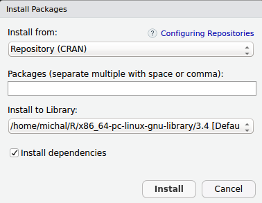

# Introduction {#intro}

## Audience
I wrote this small book for all those who are new to programming, as well for those who are new to **R** language. I tried to cover all the necessary knowledge you need to be familiarize with to start basic work in **R** in a compact way. I also tried to avoid things that may overwhelm or confuse people who are new to programming (like code efficiency). However if you want to play more, with more complex coding you need to read a lot from other sources. You will find some advises what should you do next in last chapter (\@ref(finalind)) of this book.

## What this book is not about?
Mainly this book not on any advanced R. I do not cover here things like *function factories*, *creating packages* or *S3* classes. It also do not cover specific **R** application in detail, like *statistics*, *predictive modeling* or *text analyses*. Finally this book will not cover programming paradigms such as *Test Driven Development* or *Meta-programming*. There are plenty of well written resources that go really deep in those applications.

## RStudio
Before we jump into coding, you should first get familiar with **RStudio** [@rstudio2017]. It is so called *Integrated Development Environment* (IDE), which has built-in functionalities to make work easier. This IDE is typically used with 4 different windows:

* *Source* - where you can write scripts;
* *Console* - where scripts are executed;
* *'Environmental'* - it's adjustable window, usually containing *Environemnt*, *History* and Version Control panes;
* *'Files'* - also adjustable, usually you will find here *File*, *Packages*, *Help* and *Plots* panes.

## Few tips to make life easier
From menu choose *Tools > Global options*. Now choose *Code* and *Editing* pane, tick box *Insert spaces for Tab* and assure that Tab width is set to 2. Next, in *Display* pane, check following tick-boxes:
```{r option-settings, echo = FALSE, out.width = '50%', fig.align = 'center', fig.cap = 'Code display options'}
knitr::include_graphics('options.png')
```

* *Highlight selected word*
* *Show line number*
* *Show margin* (and set margin column to 80)
* *Show whitespace characters*
* *Highlite R function calls*

Generally speaking those options, do not influence how your code is performed, but will allow you to write cleaner and read easier. You can also change colors of your environment in *Appearance*.

## Installing packages
In your *'Files'* window, you will find *Packages* pane, which contains *Install* button. You can use it now, to install packages needed to perform exercises from this book. The packages are:
```{r install-packs, echo = FALSE, out.width = '50%', fig.align = 'center', fig.cap = 'Installation window'}

```

* **deSolve** [@R-deSolve]
* **fitdistrplus** [@R-fitdistrplus]
* **mc2d** [@R-mc2d]
* **minpack.lm** [@R-minpack.lm]
* **nls2** [@R-nls2]
* **nlsMicrobio** [@R-nlsMicrobio]
* **segmented** [@R-segmented]
* **tidyverse** [@R-tidyverse; @R-dplyr; @R-ggplot2; @R-tidyr]

Now every time you need functions from specific package in library you can just tick box next to package name, and RStudio will load it for you.

## Conventions

In this book, we will use following conventions:

* Names of programs and packages are in **Bold**.
* All other names e.g. names of panes menu items as well as things that needs to be stressed are in *italics*.
* Function names and variables are always written in inline code e.g. `t.test()` or `x`.
* File names are written in inline code e.g. `foo.txt`.
* Citations are in APA style, and 'clickable' e.g.click on the name and year of **knitr**  package citation [@xie2015].
* Code chunks are in blocks and result lines start with ##
```{r test-chunk, echo = TRUE}
rnorm(10, 1, 0.5)
```
* There are no `>` (*prompt*) signs in code chunks.
* Figures are floating - meaning, that they are not always immediately after they are mentioned in text.
* Tables are in *longtable* format (meaning they are not floating and might be multipage) e.g.
```{r nice-tab, tidy = FALSE}
knitr::kable(
  head(iris, 25), caption = 'Example table',
  booktabs = TRUE, longtable = TRUE
)
```
* Tables and figures and references are clickable e.g. see Table \@ref(tab:nice-tab) or see Figure \@ref(fig:option-settings).
